# Epochal Sawtooth Phenomenon
Qi Liu (liu_qi@tongji.edu.cn) and Wanjing Ma(mawanjing@tongji.edu.cn)

College of Transportation, Tongji University, Shanghai, P.R.China

Files for the results in the paper:

> Qi Liu and Wanjing Ma, 2025. The Epochal Sawtooth Phenomenon: Unveiling Training Loss Oscillations in Adam and Other Optimizers.
 - See `bert.py` for BERT model
 BERT small model benchmark settings:
 ```json
 {
    "TRAIN_DATA": "data/wikitext-103-xxl/wiki.train.tokens",
    "vocab_dir=": "vocab_500mb_30000.pkl",
    "NUM_CPUS": 8,
    "NUM_GPUS": 1,
    "batch_size": 128,
    "plot_every": 500,
    "total_num_epochs": 60,
    "num_steps_per_epoch": 7854,
    "total_num_steps": 471240,
    "num_batchs_used_for_val": 50,
    "total_num_batchs_in_val_dataset": 1587,
    "max_len": 90,
    "learning_rate": 0.0001,
    "weight_decay": 1e-05,
    "num_hiddens": 768,
    "ffn_num_hiddens": 1024,
    "num_heads": 6,
    "num_blks": 6,
    "dropout": 0.2,
    "clip_grad": false,
    "clip_grad_max_norm": 1.0,
    "use_warmup_lr_scheduler": false,
    "use_lr_scheduler": false,
    "lr_scheduler_step_size": 5000,
    "lr_scheduler_gamma": 1.0,
    "smoothing_coeff": 1.0
}
```
BERT tiny model benchmark settings:
```json
{
    "TRAIN_DATA": "data/wikitext-2-v1/wiki.train.tokens",
    "vocab_dir=": "vocab_500mb_30000.pkl",
    "NUM_CPUS": 8,
    "NUM_GPUS": 1,
    "batch_size": 32,
    "plot_every": 50,
    "total_num_epochs": 30,
    "num_steps_per_epoch": 1323,
    "total_num_steps": 39690,
    "num_batchs_used_for_val": 10,
    "total_num_batchs_in_val_dataset": 147,
    "data_loader_shuffle": true,
    "max_len": 90,
    "learning_rate": 0.0001,
    "weight_decay": 1e-05,
    "beta_1": 0.9,
    "beta_2": 0.999,
    "num_hiddens": 256,
    "ffn_num_hiddens": 512,
    "num_heads": 2,
    "num_blks": 2,
    "dropout": 0.1,
    "clip_grad": false,
    "clip_grad_max_norm": 1.0,
    "use_warmup_lr_scheduler": false,
    "use_lr_scheduler": false,
    "lr_scheduler_step_size": 5000,
    "lr_scheduler_gamma": 0.8,
    "smoothing_coeff": 0.75
}
```
 - BERT model results
 Fig 2(a) MLM loss in BERT-small exhibits ESP.
 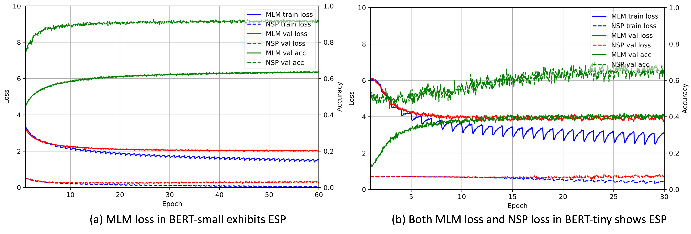


 - See `bert-tiny-benchmark.ipynb` for BERT tiny model results

 Fig 2(b) Both MLM loss and NSP loss in BERT-tiny exhibit ESP.


 - See `replication-example-benchmark.ipynb` for the Epochal Sawtooth Phenomenon (ESP) realized by using incremential quadratic optimization.

Fig. 19 The effects of data shuffling on incremental quadratic optimization.
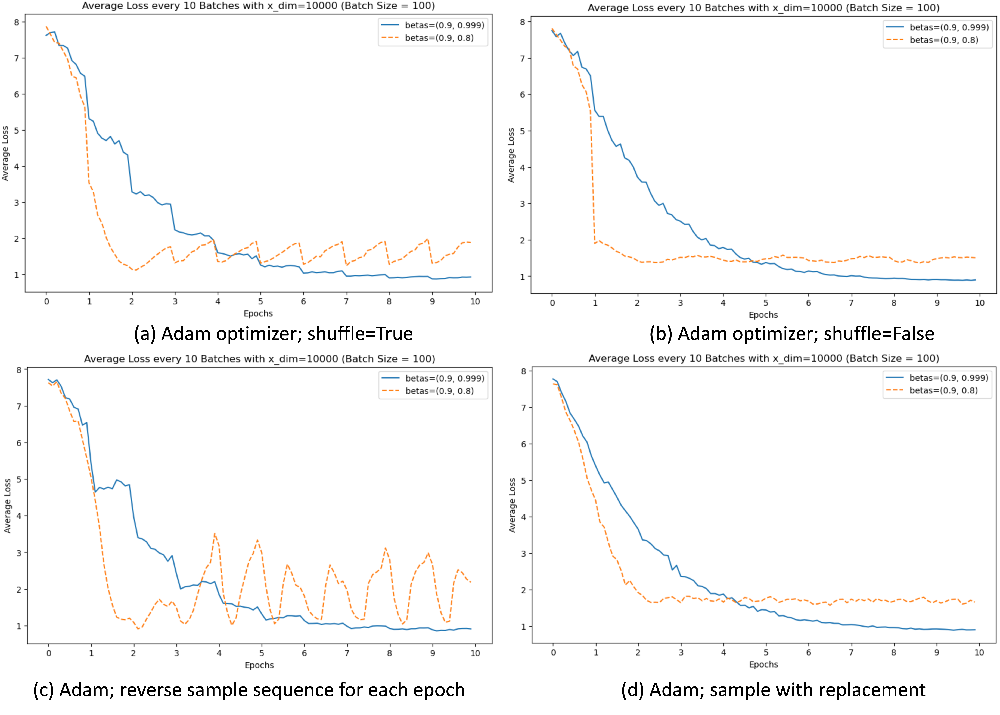


 - See `replication-example-analysis.ipynb` for the analysis on replication example (using Adam), including:


 Fig. 11 (a) m norm over epoch 4-6; (b) v norm over epoch 4-6. Momentum takes on large value at the beginning of epoch, then drop exponentially; afterwards gradually increases. ∥v∥ steadily increases during epoch.
 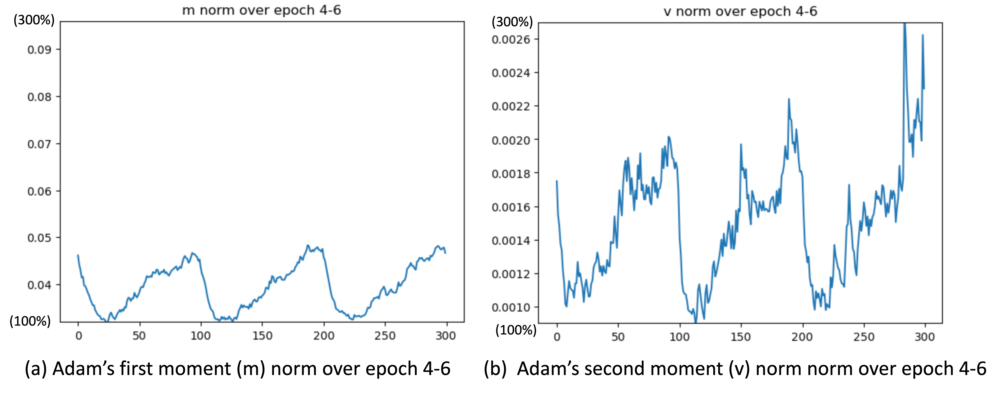


 Fig. 13 ⟨gt,∇lbt ⟩ for batch b=100.
 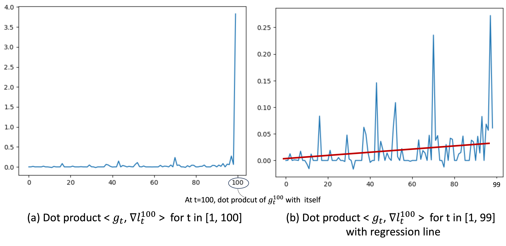


 Fig. 14 (a) ⟨mt,∇lbt ⟩
 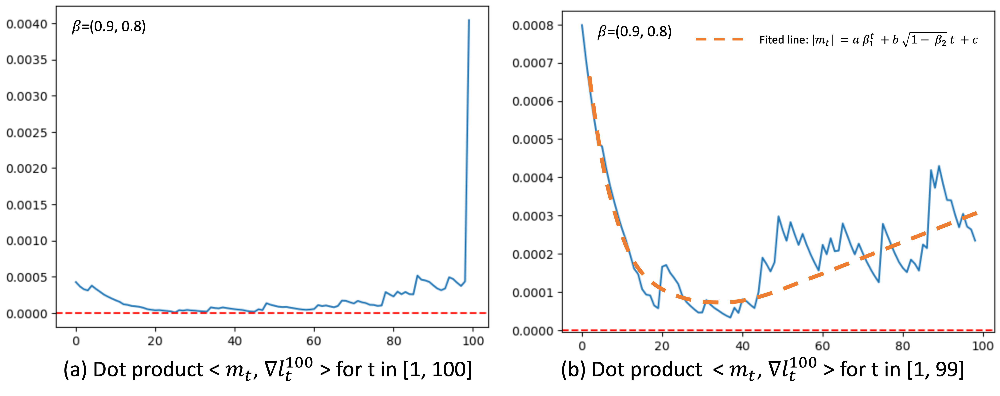


 Fig. 15 (a) ∥gt∥ over epoch 4 and 5; (b) Regression line of ∥gt∥ over epoch 4.
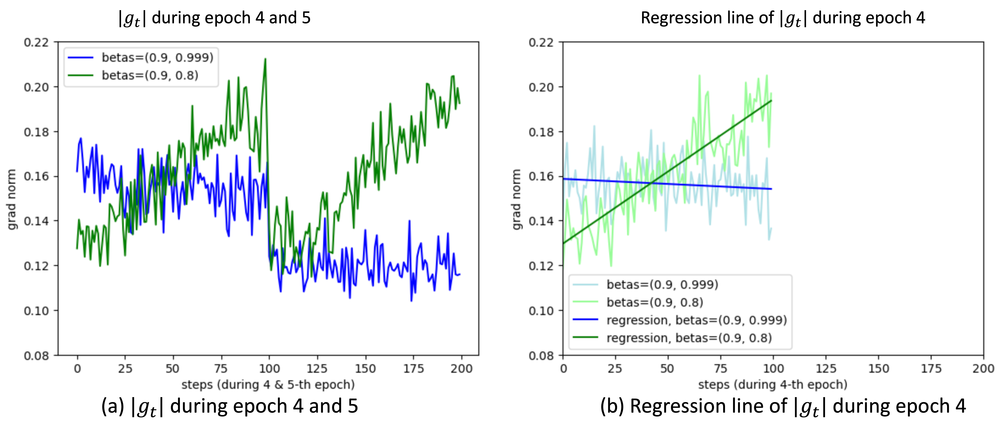


 Fig. 17 (a) ⟨Δθt,∇lb t ⟩ over epoch 4 for b=100
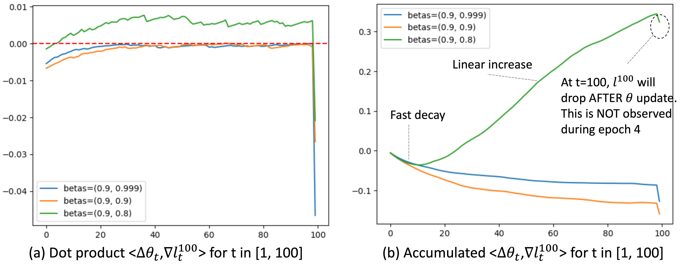

 - See `replication-example-rmsprop.ipynb` for the analysis on replication example (using RMSProp), including:

Fig. 21 Incremental quadratic optimization replication using RMSProp optimizer.
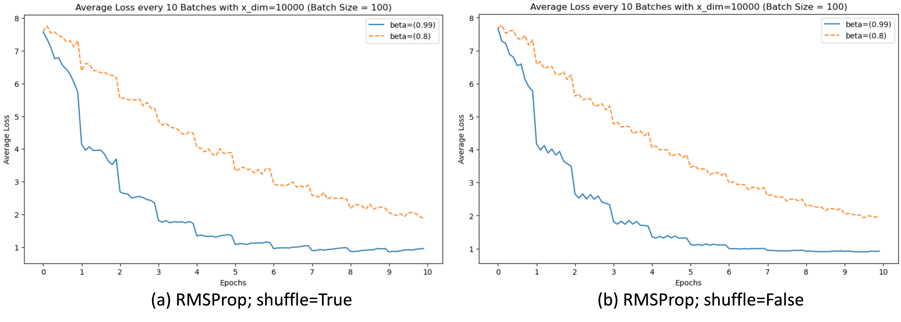


 - See `replication-example-loss-init.ipynb` for the initial loss:
 Fig. 10 (a) Training loss curve when plot every=1. (b) Histogram of loss of all batches at the start of epoch 4.
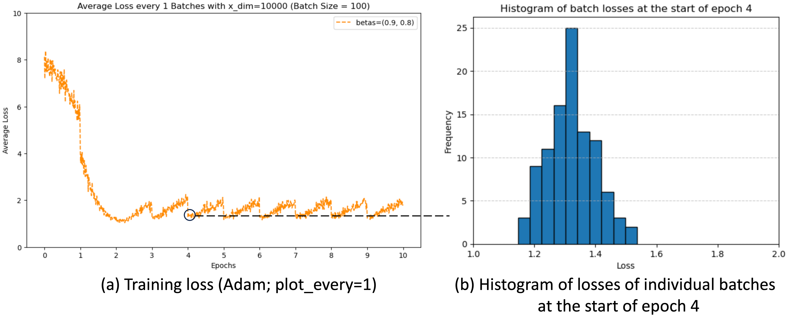


 - See `replication-example-reverse-and-with-replacement.ipynb` for the reversing the sample sequence and sample with replacement:

   
 Fig. 19 The effects of data shuffling on incremental quadratic optimization. (a) Incremental quadratic optimization with shuffle=True. ESP is replicated when we shuffle data. Smaller β2 exacerbates ESP. Similar to Figure 4 (b) When Shuffle=False, ESP is not observed. (c) Reverse the sample sequence for each epoch. This significantly amplifies the ESP, aligning with our earlier analysis illustrated in Figure 12. (d) Sample with replacement. ESP is not observed.


 - See `replication-example-analysis-different-beta2_v2.ipynb` and `replication-example-analysis-different-eps.ipynb` for the analysis on replication example (using Adam) under different beta_2 and epsilon values:
Fig. 22 The effects of varying β2 and ϵ


 - See `dot_product_analysis.ipynb` for the 3D example of dot product analysis:
 Fig. 16 The n-shaped similarity explained by low dimensional example
 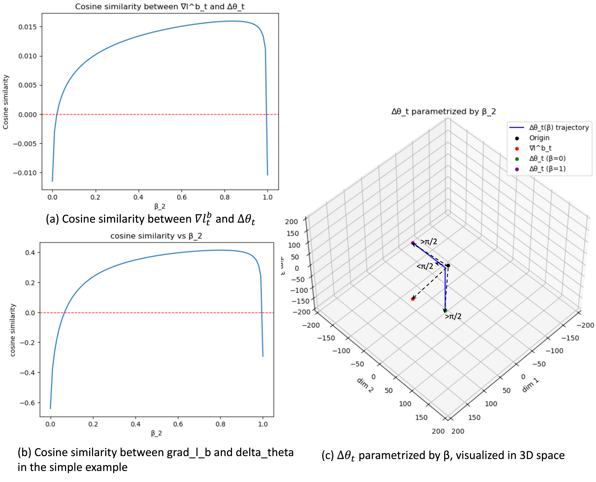


 - Additional result for model size test:
 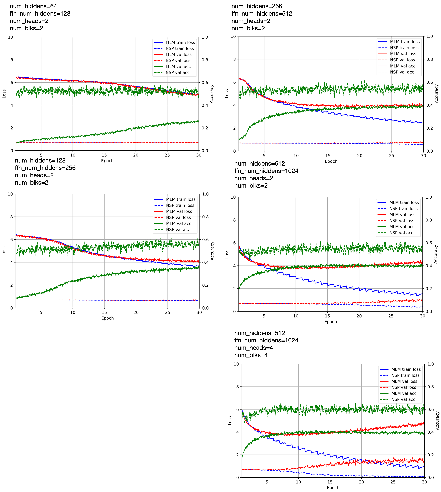


